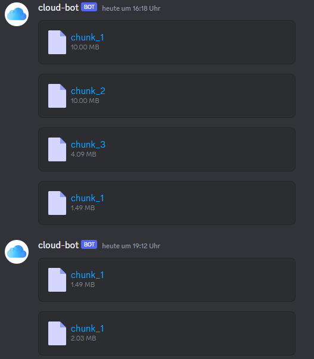

## Free Cloud on Discord

## Project Overview

Welcome to Discord Cloud, a powerful project featuring a Python-based Discord bot utilizing the py-cord library and a Flask web API. This bot is designed to streamline file management within Discord channels, with a frontend powered by React. Here's a brief overview of how it works:

## How it Works
1. File Uploads: Users can effortlessly upload files through the website.

2. Intelligent Chunking: Uploaded files are intelligently divided into 10 MB chunks, adhering to Discord's upload limit.

3. Message Tracking: The bot stores message IDs where the file chunks are attached.

4. File Download: When users wish to download the file, the bot retrieves and assembles the chunks, allowing for a seamless user experience.

In addition to the bot's functionality, the project includes a user-friendly web application powered by Flask on the backend and React on the frontend. This modern and responsive frontend simplifies file uploading, downloading, and overall file management.

### How to Run

Before running the bot, make sure to create a Discord bot, invite it to your server and get its Token. 
[Tutorial](https://www.youtube.com/watch?v=4XswiJ1iUaw)

#### Using Docker (recomended)
1. Build the Docker image with `sudo docker build -t free_cloud_on_discord .`
2. Run the Docker container with `sudo docker run -p [Port]:80 -e BOT_TOKEN=[Bot token] -e WEB_DOMAIN=[Your Domain (localhost)] free_cloud_on_discord`

If you use other port than 80 include it in WEB_DOMAIN (example.com:[Port])
If you prefer not to use Docker or need to make code modifications, follow these steps:

#### Discord Bot
1. Ensure Python 3.11.7 is installed.
2. Install the necessary dependencies using `pip install -r requirements.txt`.
3. Replace the Discord bot token in `main.py` with your bot token.
4. Run the bot using `python3 main.py`.

#### Flask Web Application
1. Install required dependencies using `pip install -r requirements.txt`.
2. Run the Flask app with `python3 flask_app.py`.

#### React Front-End
1. Navigate to the `frontend` directory.
2. Install dependencies using `npm install`.
3. Replace the host variable in `App.js` with your Domain/Host name.
4. Compile everything with `sudo npm run build`.
5. Start the server with `sudo node main.js`.
6. Access the React app at `http://localhost:81`.

### Nginx
1. Install nginx using `sudo apt install nginx`
2. Place the `nginx.conf` in `/etc/nginx/`
3. Start nginx with `sudo systemctl start nginx`

## Screenhots

### Contributors
- Jan Kupke

### License
This project is licensed under the [MIT License](LICENSE).

Feel free to contribute, report issues, or suggest improvements! Your involvement is highly appreciated.
